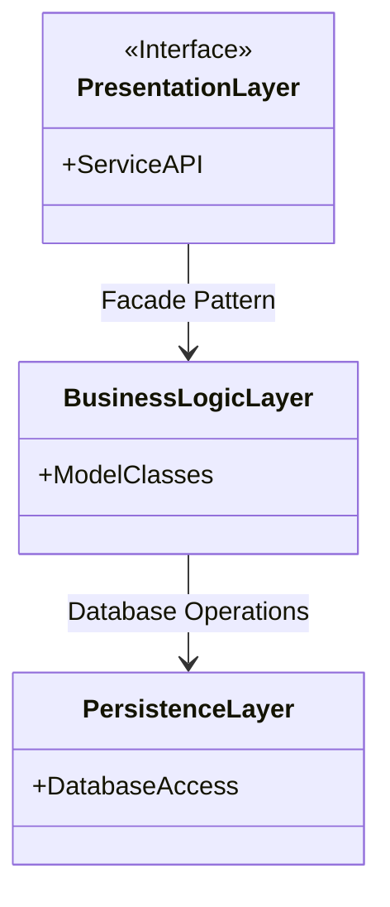

### Task 1: High-Level Package Diagram

#### Objective
Create a high-level package diagram that illustrates the three-layer architecture of the HBnB application and the communication between these layers via the facade pattern. This diagram will provide a conceptual overview of how the different components of the application are organized and how they interact with each other.

#### Description
In this task, you will develop a package diagram that visually represents the structure of the application, focusing on its three main layers:

1. **Presentation Layer (Services, API):** This layer handles the interaction between the user and the application. It includes all the services and APIs that are exposed to the users.

2. **Business Logic Layer (Models):** This layer contains the core business logic and the models that represent the entities in the system (e.g., User, Place, Review, Amenity).

3. **Persistence Layer:** This layer is responsible for data storage and retrieval, interacting directly with the database.

Your diagram should clearly show the three layers, the components within each layer, and the communication pathways between them. The facade pattern should be represented as the interface through which the layers interact.

#### Steps to Complete the Task

1. **Understand the Layered Architecture**
  - Review the concept of layered architecture and how it is used to organize an application.
  - Understand the responsibilities of each layer in the context of the HBnB application.

2. **Research the Facade Pattern**
  - Familiarize yourself with the facade design pattern and how it simplifies interactions between layers by providing a unified interface.

3. **Identify Key Components**
  - Identify the key components that belong to each layer:
      - **Presentation Layer:** Services, API endpoints.
      - **Business Logic Layer:** Core models (User, Place, Review, Amenity).
      - **Persistence Layer:** Database access objects or repositories.

4. **Draft the Package Diagram**
  - Create a draft of your package diagram, showing the three layers and their components.
  - Indicate the communication pathways between layers via the facade pattern.
  - Ensure that the diagram is clear, logical, and easy to understand.

5. **Review and Refine**
  - Review your diagram to ensure that it accurately represents the application's architecture.
  - Make any necessary adjustments to improve clarity and completeness.

#### Example of a generic package diagram using Mermaid.js:

### **Learning Resources**

- [[Concept Page] Software Architecture Patterns - Layered Architecture in Python](https://intranet.hbtn.io/concepts/1158)
- [Facade Pattern Overview](https://refactoring.guru/design-patterns/facade)
- [UML Package Diagram Guide](https://www.visual-paradigm.com/guide/uml-unified-modeling-language/what-is-package-diagram/)
- [UML Package Diagram Overview](https://www.uml-diagrams.org/package-diagrams.html)

#### Deliverables

- **High-Level Package Diagram:**
  - A clear, well-organized package diagram showing the three layers (Presentation, Business Logic, Persistence).
  - Communication pathways between layers via the facade pattern.
  
- **Explanatory Notes:**
  - A brief description of each layer and its responsibilities.
  - Explanation of how the facade pattern facilitates communication between the layers.

#### Recommendations

- **Start Simple:** Begin with a basic structure, then refine it as you understand the relationships and components better.
- **Use Mermaid.js:** If you are comfortable with coding, Mermaid.js is a great option for creating diagrams as part of your project documentation. It’s especially useful for version control and iterative development.
- **Seek Feedback:** Once your diagram is drafted, get feedback from peers or tutors to ensure clarity and accuracy.
- **Document As You Go:** Keep notes on your design decisions, as these will be useful when you compile your final documentation.
