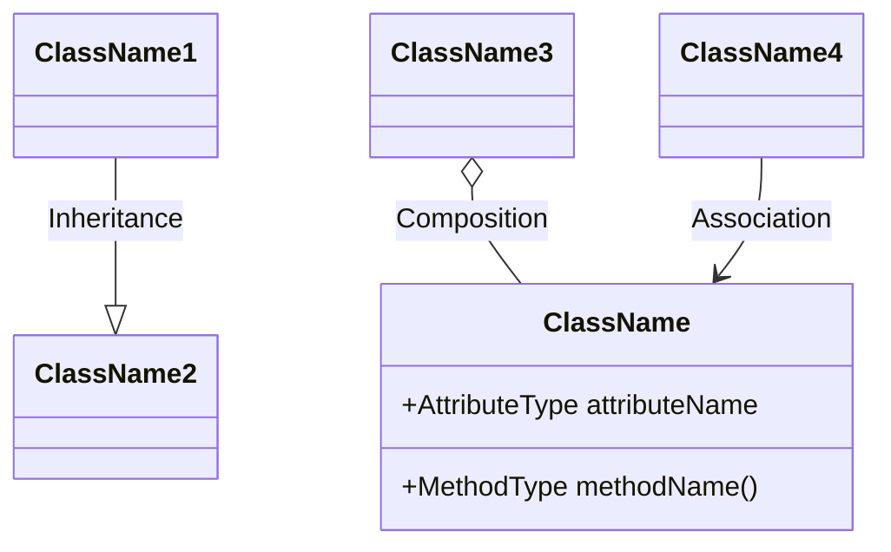

### Task 2: Detailed Class Diagram for Business Logic Layer

#### Objective
Design a detailed class diagram for the Business Logic layer of the HBnB application. This diagram will depict the entities within this layer, their attributes, methods, and the relationships between them. The primary goal is to provide a clear and detailed visual representation of the core business logic, focusing on the key entities: User, Place, Review, and Amenity.

#### Description
In this task, you will create a class diagram that represents the internal structure of the Business Logic layer. This diagram will include entities, their attributes, methods, and relationships such as associations, inheritance, and dependencies.

#### Steps to Complete the Task

1. **Review the Business Logic Requirements**
  - Understand the business rules and requirements for each entity in the Business Logic layer.
  - Review how these entities interact with each other and the significance of their relationships.

2. **Identify Key Attributes and Methods**
  - For each entity, identify the key attributes and methods that define its behavior and state.
  - Ensure that each entity includes a unique identifier (UUID4) and attributes for creation and update dates.

3. **Design the Class Diagram**
  - Begin by outlining the entities as classes, specifying their attributes and methods.
  - Represent relationships between entities using appropriate UML notation (e.g., associations, generalizations, compositions).
  - Include multiplicity where relevant.

4. **Refine and Review**
  - Review the diagram to ensure that it accurately represents the business logic and adheres to the project’s requirements.
  - Refine the diagram as needed to improve clarity and completeness.

#### Example of a generic class diagram using Mermaid.js:

### **Learning Resources**

- [UML Class Diagram Tutorial](https://creately.com/blog/diagrams/class-diagram-tutorial/)
- [How to Draw UML Class Diagrams](https://www.visual-paradigm.com/guide/uml-unified-modeling-language/what-is-class-diagram/)
- [[Concept Page] OOP - SOLID Pronciples](https://intranet.hbtn.io/concepts/1216)
- [SOLID Principles of Object-Oriented Design](https://www.freecodecamp.org/news/solid-principles-explained-in-plain-english/)

#### Deliverables

- **Detailed Class Diagram:**
  - A comprehensive class diagram showing the key entities, including their attributes, methods, and relationships.
  - Proper use of UML notation to depict associations, generalizations, and compositions.

- **Explanatory Notes:**
  - A brief description of each entity, including its role in the system and key attributes and methods.
  - Explanation of relationships between entities and how they contribute to the overall business logic.

#### Recommendations

- **Start with a Basic Outline:** Begin by defining the classes and their basic attributes. Once you have the core structure, add methods and refine the relationships between entities.
- **Leverage Mermaid.js:** If you are comfortable with coding, consider using Mermaid.js for creating and maintaining your class diagram as part of your project documentation.
- **Consider Relationships Carefully:** Pay close attention to how entities are related, especially when defining associations and compositions. Ensure that these relationships are accurately represented in your diagram.
- **Iterate and Improve:** Don’t hesitate to revise your diagram as you refine your understanding of the system. Continuous improvement will lead to a more accurate and comprehensive representation.
