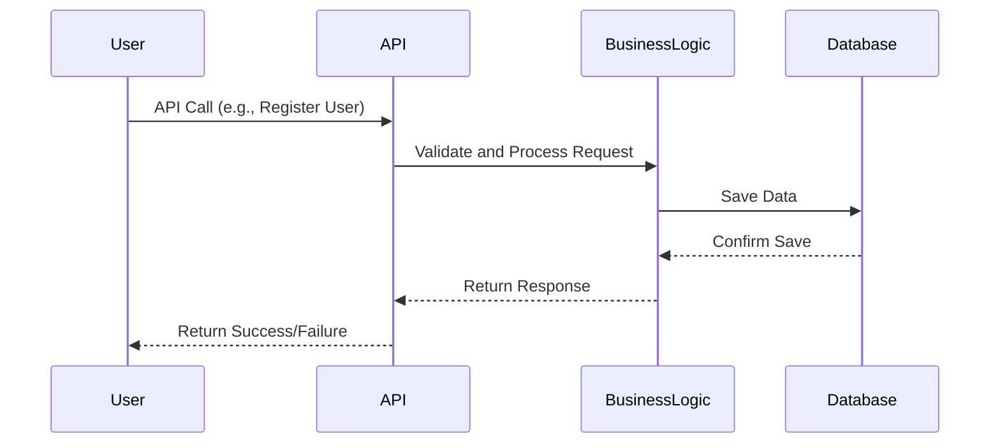

### Task 3: Sequence Diagrams for API Calls

#### Objective
Develop sequence diagrams for at least four different API calls to illustrate the interaction between the layers (Presentation, Business Logic, Persistence) and the flow of information within the HBnB application. The sequence diagrams will help visualize how different components of the system interact to fulfill specific use cases, showing the step-by-step process of handling API requests.

#### Description
In this task, you will create sequence diagrams that represent the flow of interactions across the different layers of the application for specific API calls. These diagrams will show how the Presentation Layer (Services, API), Business Logic Layer (Models), and Persistence Layer (Database) communicate with each other to handle user requests.

You will create sequence diagrams for the following API calls:

1. **User Registration:** A user signs up for a new account.
2. **Place Creation:** A user creates a new place listing.
3. **Review Submission:** A user submits a review for a place.
4. **Fetching a List of Places:** A user requests a list of places based on certain criteria.

#### Steps to Complete the Task

1. **Understand the Use Cases**
  - Review the requirements and business logic for each of the selected API calls.
  - Understand the sequence of operations needed to fulfill each API call, from the moment a request is received by the API to the point where a response is returned to the client.

2. **Identify Key Components Involved**
  - Determine which components of the system (within each layer) are involved in handling each API call.
  - Identify the order of operations, including method calls and data exchanges between components.

3. **Design the Sequence Diagrams**
  - Begin by drafting the sequence of interactions for each API call.
  - For each diagram, start with the API call from the Presentation Layer, followed by interactions with the Business Logic Layer, and ending with operations in the Persistence Layer.
  - Clearly show the flow of messages, including method invocations, data retrieval, and processing steps.

4. **Refine and Review**
  - Review your diagrams to ensure they accurately reflect the flow of information and operations required to fulfill each API call.
  - Refine the diagrams for clarity and completeness, ensuring all relevant interactions are captured.

#### Example of a generic sequence diagram using Mermaid.js:

### **Learning Resources**

- [UML Sequence Diagram Tutorial](https://creately.com/blog/diagrams/sequence-diagram-tutorial/)
- [Understanding Sequence Diagrams](https://www.uml-diagrams.org/sequence-diagrams.html)
- [RESTful API Design Guide](https://restfulapi.net/)

#### Deliverables

- **Sequence Diagrams:**
  - Four sequence diagrams, each depicting the interaction flow for a specific API call (User Registration, Place Creation, Review Submission, Fetching a List of Places).
  - Diagrams should clearly illustrate the communication between layers and the sequence of operations required to process each request.

- **Explanatory Notes:**
  - A brief description of each API call, outlining the key steps involved and the purpose of the sequence diagram.
  - Explanation of the flow of interactions, highlighting how each layer contributes to fulfilling the API request.

#### Recommendations

- **Focus on Clarity:** Ensure that your diagrams are easy to read and understand. Use consistent naming conventions for components and clearly indicate the flow of messages.
- **Use Mermaid.js for Code-Based Diagrams:** If you prefer working with code, Mermaid.js offers a straightforward way to create and maintain sequence diagrams as part of your documentation.
- **Double-Check the Flow:** Make sure the sequence of operations in your diagrams accurately reflects the intended behavior of the system. Each step should logically follow the previous one.
- **Iterate as Needed:** Don't hesitate to revise your diagrams as you refine your understanding of the system's interactions. The goal is to create accurate and informative representations of the API calls.
