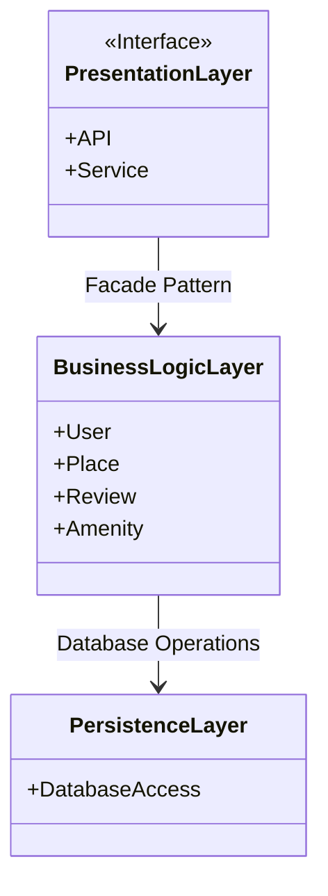
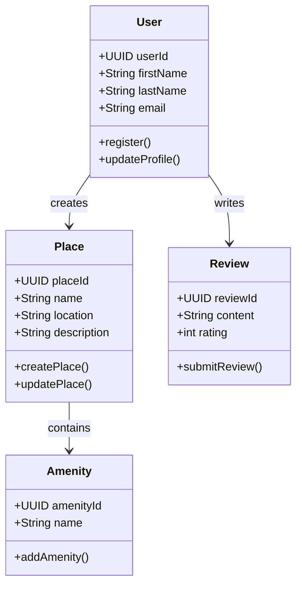
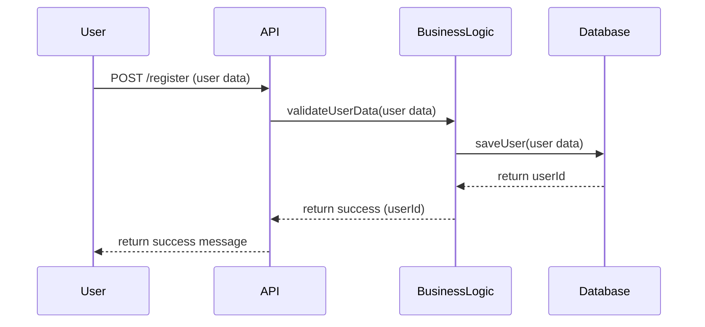
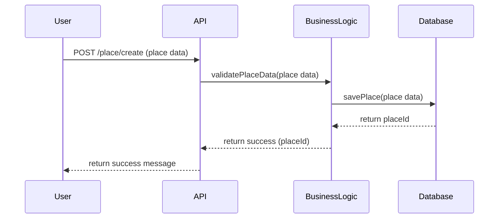
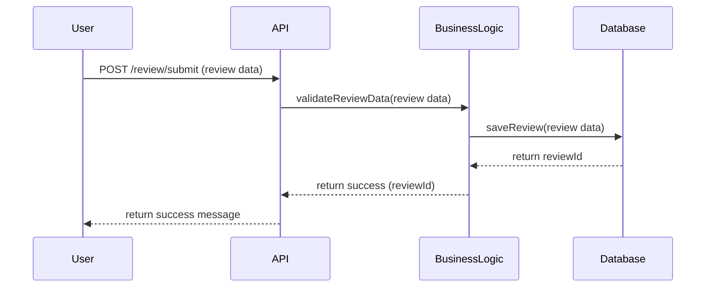
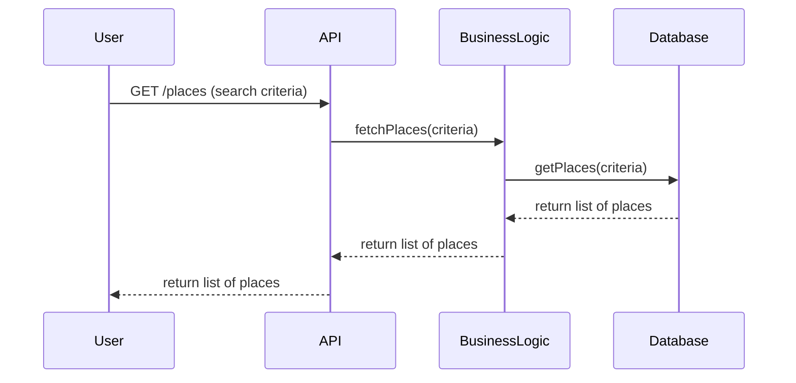

# Documentation Technique du Projet HBnB

## Introduction

### Objectif du Document
Ce document technique décrit l'architecture et la conception du système HBnB. Il présente les principaux diagrammes, ainsi que des notes explicatives pour chaque élément, afin de guider l'implémentation du projet. Ce document doit être utilisé comme référence pendant toute la phase de développement.

### Aperçu du Projet
HBnB est une application de location de logements où les utilisateurs peuvent créer des annonces pour leurs propriétés, soumettre des avis, et réserver des logements. Le système est structuré en trois couches principales : **Présentation**, **Logique Métier**, et **Persistence**. Cette architecture est conçue pour faciliter la gestion des données et assurer une évolutivité optimale.

---

## 1. Architecture de Haut Niveau

### Diagramme de Package

Le diagramme suivant représente l'architecture en couches du système HBnB, en mettant en évidence les principales couches : **Présentation**, **Logique Métier**, et **Persistence**.

### Business Logic Layer - Diagramme de Classe

Le diagramme suivant présente les principales classes de la couche Logique Métier, avec leurs attributs et leurs relations.

### Sequence Diagrams for API Calls

Voici les diagrammes représentant les interactions entre les différentes couches lors de certains appels API dans l'application HBnB.

**User Registration**

**Place Creation**

**Review Submission**

**Fetching a List of Places**

